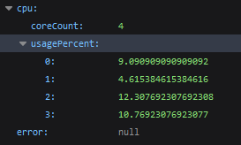
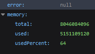

# go-monitor




## Building

```
go build -o go-monitor
chmod +x go-monitor
```

## Running

`go-monitor` requires you to provide a username and password for authentication.

```bash
# on linux:
GO_MONITOR_LOGIN=user GO_MONITOR_PASSWORD=pass ./go-monitor
```

This will set the username to `user` and the password to `pass`.
